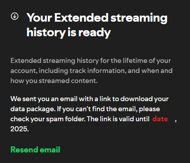

# Spotify Data Analysis  &nbsp; &nbsp; 

It's fun to get statistics on your all-time Spotify data!
For example, I have **~7,200** unique artists listened to!

-----
## How to Use:

1. Visit your Spotify account: https://www.spotify.com/us/account/privacy/. <br>
Scroll to the bottom and download your 'Extended streaming history'.<br><br>
 <br><br>
2. Extract the folder. Write the name of your folder into a .txt file. 
3. Consolidate your data, cleaned into a single .csv by running the following code: <br>
```python
username = TextWriterSingleLine("current_user.txt").load()
streaming_history_audios_to_csv(f"Spotify Extended Streaming History/{username}/",
                                    f"Spotify History Audio/{username}/")

append_all_to_csv(f"Spotify History Audio/{username}/")
```
